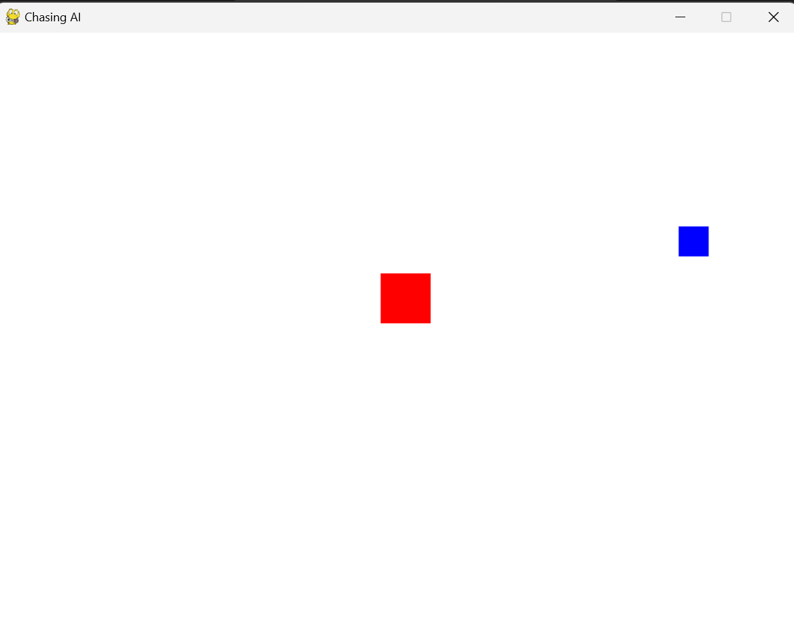

# Chasing AI

Chasing AI is a simple game built using Pygame where a player-controlled character (red square) chases a target (blue square) controlled by the mouse cursor.

## Demo Images

*Gameplay screenshot showing the red square chasing the blue target.*

## Features
- Simple gameplay mechanics.
- Basic AI for the red square to chase the target.
- Adjustable player and target sizes.
- Adjustable player movement speed.

## Requirements
- Python 3.x
- Pygame

## How to Play
1. Clone or download the repository to your local machine.
2. Make sure you have Python and Pygame installed on your machine.
3. Run the `game.py` file.
4. Use the mouse cursor to control the movement of the blue target square.
5. The red square will automatically chase the blue target square.
6. Try to evade the red square for as long as possible!

## How to Contribute
If you'd like to contribute to this project, you can:

1. Fork the repository.
2. Create a new branch.
3. Make your changes.
4. Test your changes thoroughly.
5. Submit a pull request detailing your changes.

## Credits
This project was created by Prakhar Agrawal.

